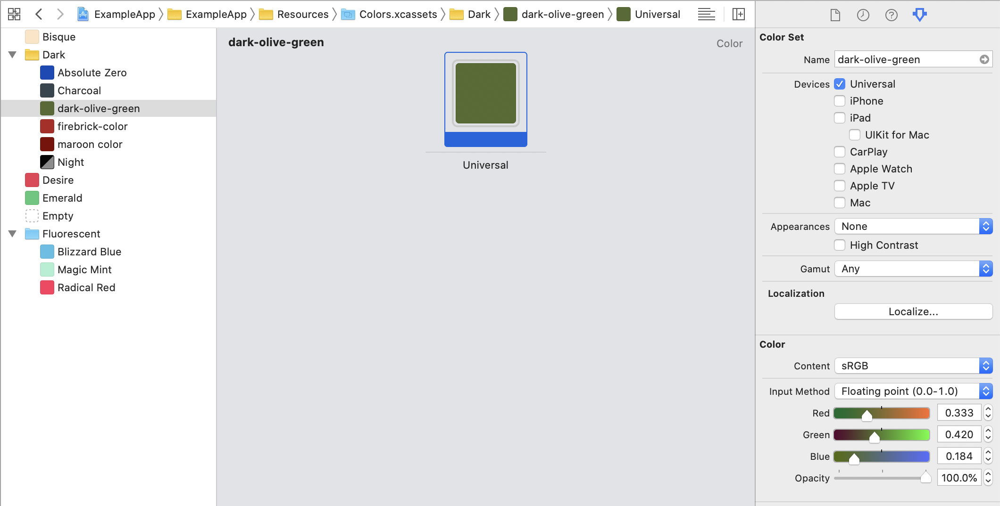

## CGColor Usage

Scans through asset catalogs.

### Xcode Editor Autocomplete


### Xcode Asset Catalog



### Backboard Generated Code

[ColorAsset.blackboard.swift](/ExampleApp/Source/Generated/ColorAsset.blackboard.swift#L9)

```swift
public enum ColorAsset: String {
    case absoluteZero = "Absolute Zero"
    case bisque = "Bisque"
    case charcoal = "Charcoal"
    case darkOliveGreen = "dark-olive-green"
    case desire = "Desire"
    case emerald = "Emerald"
    case empty = "Empty"
    case firebrick = "firebrick-color"
    case fluorescentBlizzardBlue = "Fluorescent/Blizzard Blue"
    case fluorescentMagicMint = "Fluorescent/Magic Mint"
    case fluorescentRadicalRed = "Fluorescent/Radical Red"
    case maroon = "maroon color"
    case night = "Night"
}
```

[CGColor.blackboard.swift](/ExampleApp/Source/Generated/CGColor.blackboard.swift#L9)

```swift
public extension ColorAsset {
    var cgColor: CGColor
}

public extension CGColor {
    static var absoluteZero: CGColor
    static var bisque: CGColor
    static var charcoal: CGColor
    static var darkOliveGreen: CGColor
    static var desire: CGColor
    static var emerald: CGColor
    static var empty: CGColor
    static var firebrick: CGColor
    static var fluorescentBlizzardBlue: CGColor
    static var fluorescentMagicMint: CGColor
    static var fluorescentRadicalRed: CGColor
    static var maroon: CGColor
    static var night: CGColor
}
```

### The Blackboard Way

[ExampleApp](/ExampleApp/Source/FooterViewController.swift#L45)
```swift
view.layer.borderColor = .fluorescentBlizzardBlue
```

### The Standard UIKit Way

[StandardApp](/StandardApp/Source/FooterViewController.swift#L47)
```swift
view.layer.borderColor = UIColor(named: "Fluorescent/Blizzard Blue")?.cgColor
```
